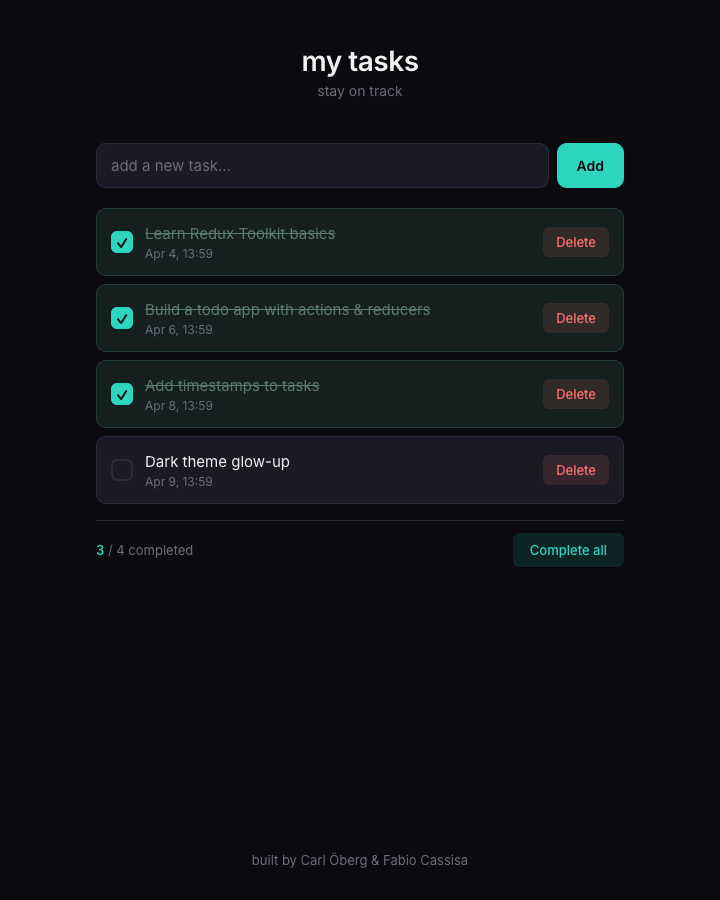
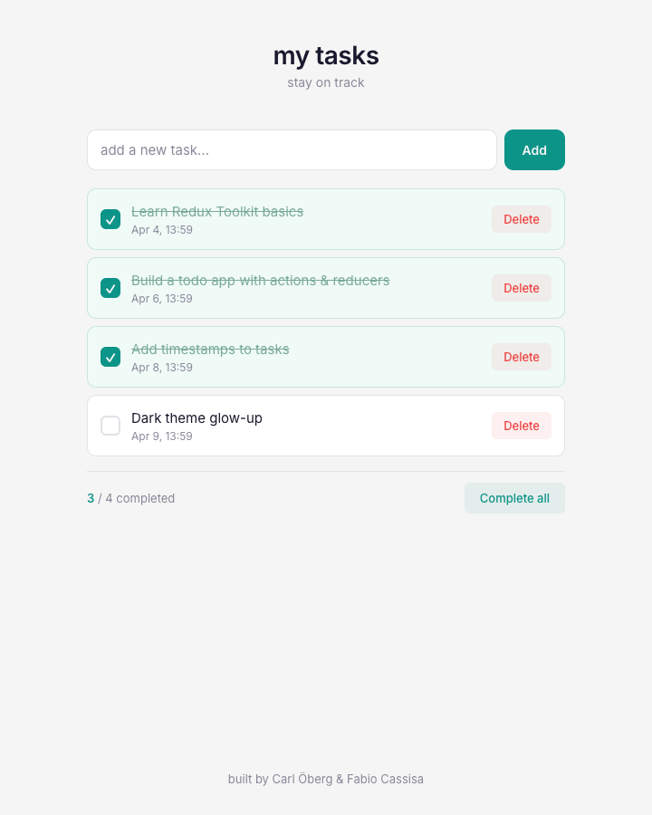

# my tasks

a minimal todo app with redux state management — add tasks, check them off, delete them, or nuke the list with "complete all".

## context

built as a pair project during the technigo bootcamp with [carl öberg](https://github.com/Calleobe). the original version used redux toolkit and styled-components but had a broken build (missing `date-fns` dependency), default browser checkboxes, and a flat grey design.

this version fixes the build, strips out dead dependencies, and redesigns everything: dark-first theme with teal accent, custom checkboxes, strikethrough on completed tasks, and a clean status bar showing progress.

## screenshots

| dark | light |
|------|-------|
|  |  |

## stack

`react 18` · `redux toolkit` · `styled-components 6` · `date-fns` · `vite 4` · `vercel`

## features

- **add / toggle / delete** — core crud via redux actions
- **complete all** — one button to mark everything done (disables when all complete)
- **timestamps** — each task shows when it was created
- **custom checkboxes** — styled replacements for browser defaults with teal fill + checkmark
- **strikethrough** — completed tasks get muted text + line-through
- **completion counter** — status bar shows `n / total completed`
- **system theme** — dark by default, respects `prefers-color-scheme: light`
- **empty state** — friendly message when no tasks exist

## structure

```
src/
├── components/
│   ├── AddTaskForm.jsx   # input + add button
│   ├── TaskList.jsx      # task list + status bar + complete all
│   ├── TaskItem.jsx      # card with custom checkbox, text, delete
│   ├── Header.jsx        # title
│   └── Footer.jsx        # credits
├── reducers/
│   └── tasks.js          # redux slice — add, toggle, delete, completeAll
├── App.jsx               # store provider + layout shell
├── index.css             # theme tokens, reset, light theme
└── main.jsx              # entry point
```

## setup

```bash
npm install
npm run dev
```

## status

🟢 live — [project-todo-list-beta.vercel.app](https://project-todo-list-beta.vercel.app)

---

<sub>built by [fabio cassisa](https://github.com/fabio-cassisa) · paired with [carl öberg](https://github.com/Calleobe)</sub>
